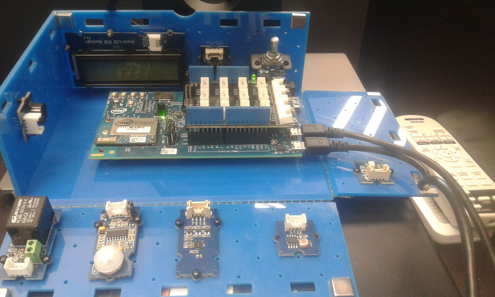
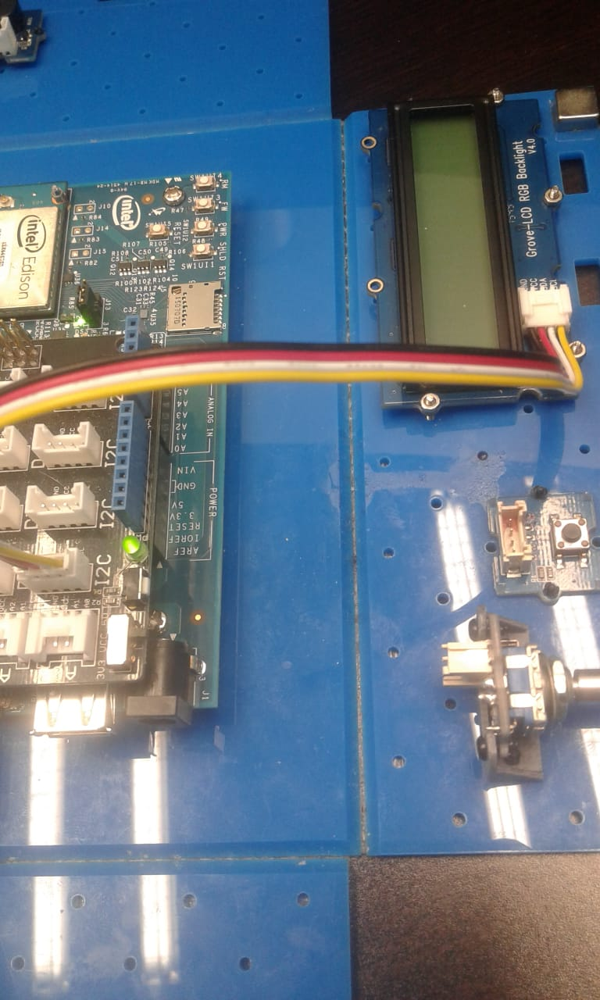
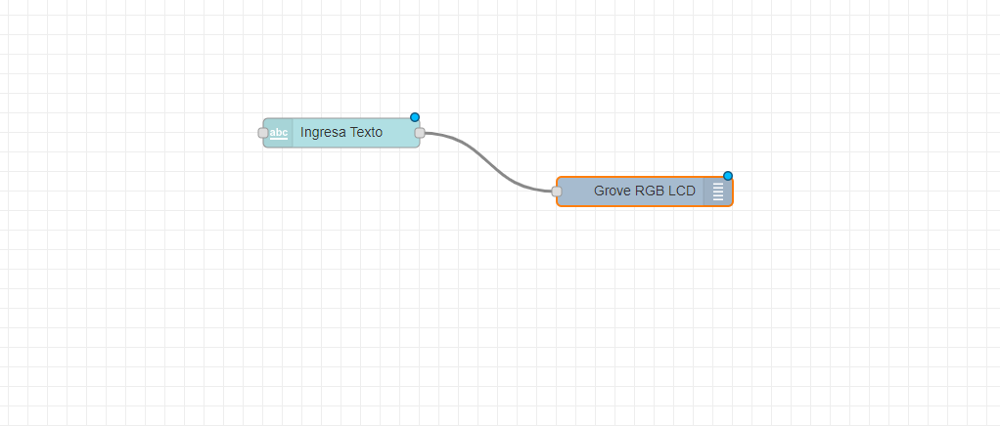
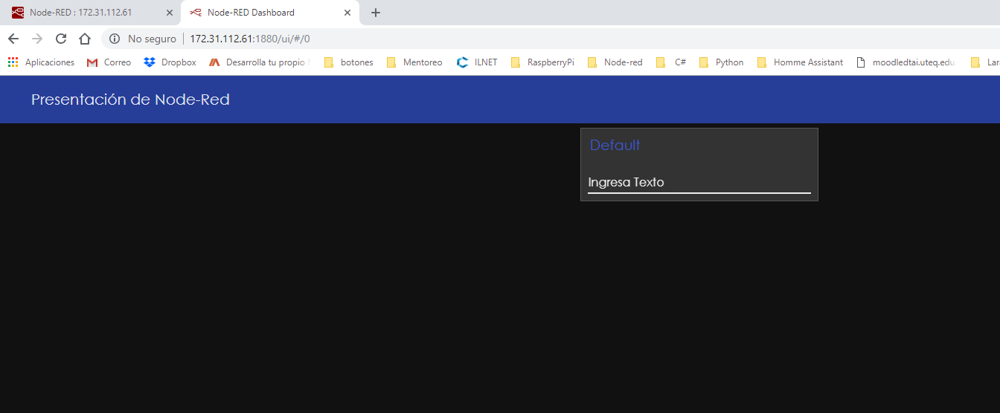
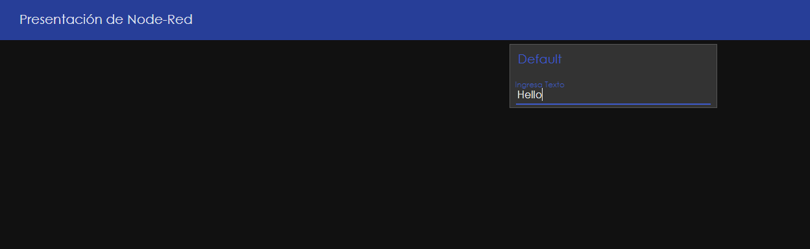
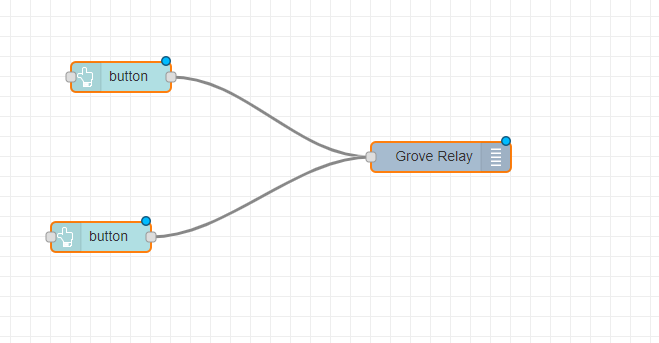
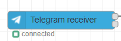
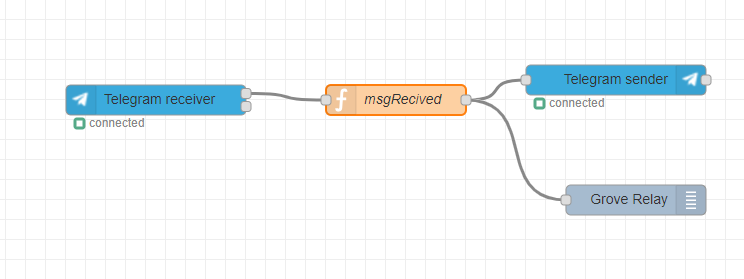
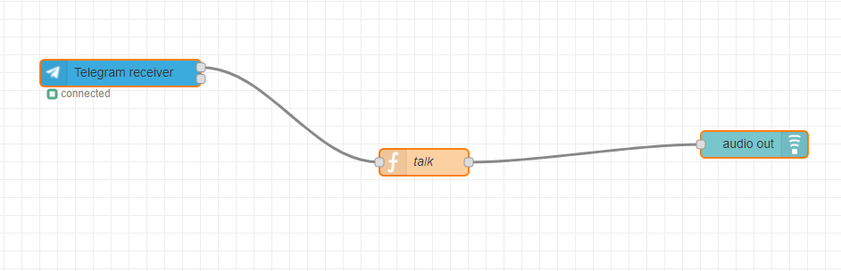

# Basic_Node_Red
This is a repository where you can find some flows on node-red and we use some libraries from telegram. 

I want to add to this repository the libraries that have been used, 
for the creation of boots as well as the tutorials that have been used 
for the realization of the workshops with this software. 

So Firts I tell you the hardware I use is a Intel Edison.

 
 

This Device use a operative system Yocto of linux and in this Device I downloaded some libraries of this link: 

https://theiotlearninginitiative.gitbook.io/ibminternetofthings/node-red/installation

But I only use: 
* mraa
* galileo-io
* node-red
* node-red-contrib-gpio
*node-red-node-intel-gpio
* node-red-contrib-grove-edison
* node-red-contrib-upm

And for use Telegram and the Dashboard of NodeRed I installed: 

  https://flows.nodered.org/node/node-red-contrib-telegrambot
* node-red-contrib-telegrambot (For Telegram)

  https://github.com/node-red/node-red-dashboard
* npm i node-red-dashboard (For Dasboard)

The First Flow I created is to send some text to LCD connected on the Edison device. This hardware is connected to an input of type 
I2C: 

Then we will make the flows for the connection of the LCD to a text entry of the Dashboard. 
Like this : 

at the moment of running the project in the dash a screen like the following will be displayed

 	

And now you can use you're text input and the LCD 

 

  
The next We conected is a relay with two bittons or a switch but in the same dashboard. 

I prefer two buttons but is the same with the switch. 
We need to send in both button 
Well in one of both I configure this send a number one and the other send 0 because the relay on with a one an off need to sendo to 0 

 

* And dont forget configured the relay to digital pin. 

So after that you can see on the dashboard something like this.

So the next step is Telegram and Node-Red 

In this repository I got the flows and the steps to create a dunctions with Noide-Red and Telegram , like turn on a Relay an send a message and you can do the computer talk the message you send. 
Dont forgat you need a libraries of Telegram (https://flows.nodered.org/node/node-red-contrib-telegrambot)

First Flow: 
On Relay and Off Relay 

You need to use th bolck of telegram receiver 

Next you need to create a function where you define what is the command you use to turn on the relay and turn off  in my case is "/onrelay" dont forget the slash because the command you send is something like this.

And you use the conditional to verify what is the command you send. 

msg.payload.content =  msg.payload.content

if(msg.payload.content == "/onrelay"){
    
    msg.payload = 1
}

else if(msg.payload.content == "/offrelay"){
   
 msg.payload = 0
}

return msg;

And finally you link one block with the function and you use the Grove Relay block 

And yo have something like this: 

Now We can do the computer talk with the message you send you only change the function with something like this: 

msg.payload.content =  msg.payload.content

if(msg.payload.content == msg.payload.content){
    
    msg.payload = msg.payload.content
}

return msg;

and the flow is something like this: 

And if you send some mesage the computer repites the message you send. 

