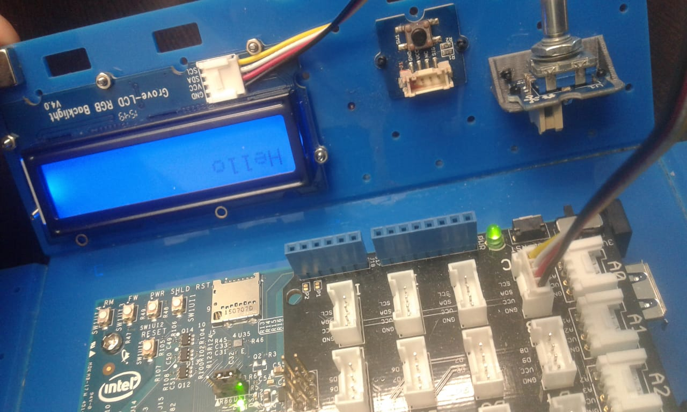

# Basic_Node_Red
This is a repository where you can find some flows on node-red and we use some libraries from telegram. 

I want to add to this repository the libraries that have been used, 
for the creation of boots as well as the tutorials that have been used 
for the realization of the workshops with this software. 

So Firts I tell you the hardware I use is a Intel Edison.

 
 

This Device use a operative system Yocto of linux and in this Device I downloaded some libraries of this link: 

https://theiotlearninginitiative.gitbook.io/ibminternetofthings/node-red/installation

But I only use: 
* mraa
* galileo-io
* node-red
* node-red-contrib-gpio
*node-red-node-intel-gpio
* node-red-contrib-grove-edison
* node-red-contrib-upm

And for use Telegram and the Dashboard of NodeRed I installed: 

  https://flows.nodered.org/node/node-red-contrib-telegrambot
* node-red-contrib-telegrambot (For Telegram)

  https://github.com/node-red/node-red-dashboard
* npm i node-red-dashboard (For Dasboard)

The First Flow I created is to send some text to LCD connected on the Edison device. This hardware is connected to an input of type 
I2C: 

Then we will make the flows for the connection of the LCD to a text entry of the Dashboard. 
Like this : 

at the moment of running the project in the dash a screen like the following will be displayed

 	

And now you can use you're text input and the LCD 

 

  